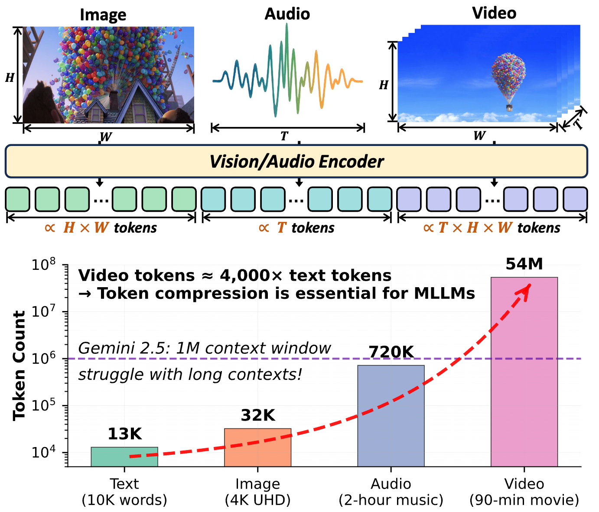

# Awesome Multimodal Token Compression

[](https://opensource.org/licenses/MIT)
[](http://makeapullrequest.com)
[](https://arxiv.org/abs/2507.20198)

##  Contact

For questions, suggestions, or collaboration opportunities, please feel free to reach out:

✉️ Email:  [shaokele@gmail.com](mailto:shaokele@gmail.com) or [KD.TAO.CT@outlook.com](mailto:KD.TAO.CT@outlook.com)

## 🔥 News

- **[2025.07.29]** The v1 survey is now published! We've also initialized the repository.

## 🎯 Motivation
<div align="left">
  
</div>

> **Motivation:** **Up:** Image, video, and audio data types can scale in their representation dimensions, leading to a corresponding increase in the number of tokens. **Down:** Top-performing MLLMs cannot address real-world demands, as the number of tokens for multimodal information, especially video, vastly exceeds that of text. Therefore, token compression is crucial to address this limitation.

## 📚 Contents

- [Awesome Token Compression](#awesome-multimodal-token-compression)
    - [Image-centric](https://github.com/cokeshao/Awesome-Multimodal-Token-Compression/tree/main/image.md)
    - [Video-centric](https://github.com/cokeshao/Awesome-Multimodal-Token-Compression/tree/main/video.md)
    - [Audio-centric](https://github.com/cokeshao/Awesome-Multimodal-Token-Compression/tree/main/audio.md)


## 🚧 TODO

- [ ] Release a web page for easily finding relevant research papers.
- [ ] Release a download tool.
- [ ] Release an easy-to-use pull request tool.

---

## 📌 Citation

Please consider citing our paper in your publications if our findings help your research.

```bibtex
@article{token_compression_survey,
  title={When Tokens Talk Too Much: A Survey of Multimodal Long-Context Token Compression across Images, Videos, and Audios},
  author={Shao, Kele and Tao, Keda and Zhang, Kejia and Feng, Sicheng and Cai, Mu and Shang, Yuzhang and You, Haoxuan and Qin, Can and Sui, Yang and Wang, Huan},
  journal={arXiv preprint arXiv:2507.20198},
  year={2025}
}
```

---

## 🤝 Contributing

We welcome contributions to this survey! Please follow these guidelines:

1. **Fork** the repository
2. **Create** a feature branch
3. **Add** relevant papers with proper formatting
4. **Submit** a pull request with a clear description

### Badge Colors
-  `red` for arXiv papers
-  `blue` for conference/journal papers
-  `white` for GitHub repositories
-  `purple` for research areas
-  `green` for categories
-  `yellow` for training cost

---

## 📄 License

This project is licensed under the MIT License - see the [LICENSE](LICENSE) file for details.

---

## 🙏 Acknowledgments

This repository is inspired by [Awesome-Efficient-Reasoning-Models](https://github.com/fscdc/Awesome-Efficient-Reasoning-Models), [Awesome-Efficient-LLM](https://github.com/horseee/Awesome-Efficient-LLM/), [Awesome-Context-Engineering](https://github.com/Meirtz/Awesome-Context-Engineering)

## 🧑‍💻 Contributors

👏 Thanks to these contributors for this excellent work！

<a href="https://github.com/cokeshao/Awesome-Multimodal-Token-Compression/graphs/contributors">
  
</a>
